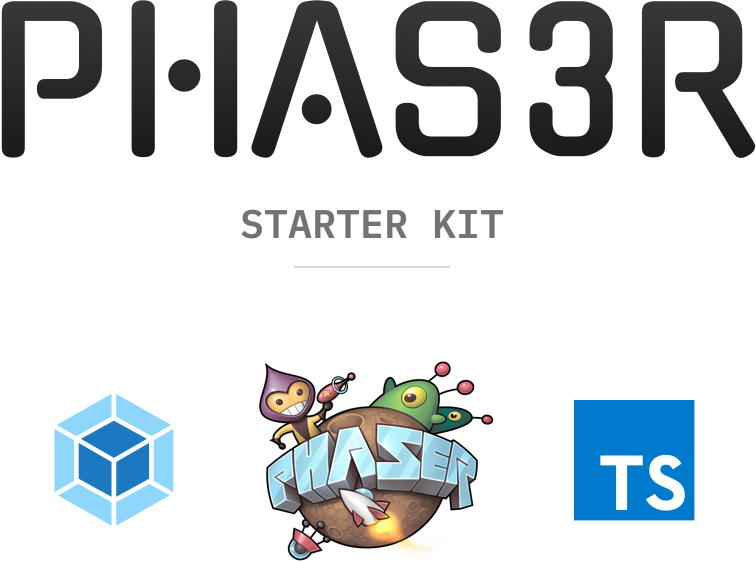

 

Have you been wanting to start a project with the [Phaser 3 game engine](https://phaser.io/phaser3) but just _don’t have the time_ to set up a good dev/build process? Well boy howdy have you come to the right place! My **Phaser 3 Starter Kit** offers everything you need and more, including:

- TypeScript support
- Source maps
- Dev server with live reloading
- Linting tools
- Build task with code minification

I guess that’s it but man does this thing _offer_ all that, you know?

## Table of contents

- [Getting started](#getting-started)
- [Development](#development)
- [Production](#production)
- [Contributing](#contributing)
- [Licenses](#licenses)

## Getting started

First, clone this repo but name it something cooler:

    $ git clone https://github.com/ngscheurich/phas3r-starter.git journey-to-the-depths-of-blood-mountain

Now hop on into your new directory and install the project’s dependencies:

    $ yarn install

`npm install` works fine too if that’s more your speed.

That’s it! You’re started!

## Development

To spin up the dev server, just:

    $ yarn start

You should now have a web server listening—and serving your game—at http://localhost:8080. Cool.

## Production

Ready to distribute your game to the ravenous masses?

    $ yarn build

This will make a production-ready version of your game in a directory called `dist`; toss it up on the Internet somewhere. [Netlify](https://www.netlify.com/) might be a good choice.

## Contributing

Pull requests are gladly accepted, however this is an admittedly opinionated setup based on my personal preferences. If you’re looking to make big changes to workflow or tooling you should fork the project.

If you do submit a PR, please adhere to the [Code of Conduct](https://github.com/ngscheurich/phas3r-starter/blob/master/CODE_OF_CONDUCT.md).

## Licenses

This project is an approximation of the game built in [Richard Davey](https://twitter.com/photonstorm)’s
article series _[Making your first Phaser 3 game](https://phaser.io/tutorials/making-your-first-phaser-3-game)_. The related art assets are distributed with [Richard’s permission](https://twitter.com/photonstorm/status/1013889130063908865).

This project is [MIT © Nicholas Scheurich](https://github.com/ngscheurich/phas3r-starter/blob/master/LICENSE).
Phaser is [MIT © Richard Davey, Photon Storm Ltd](https://github.com/photonstorm/phaser/blob/master/license.txt).
All logos are copyright their respective owners.
